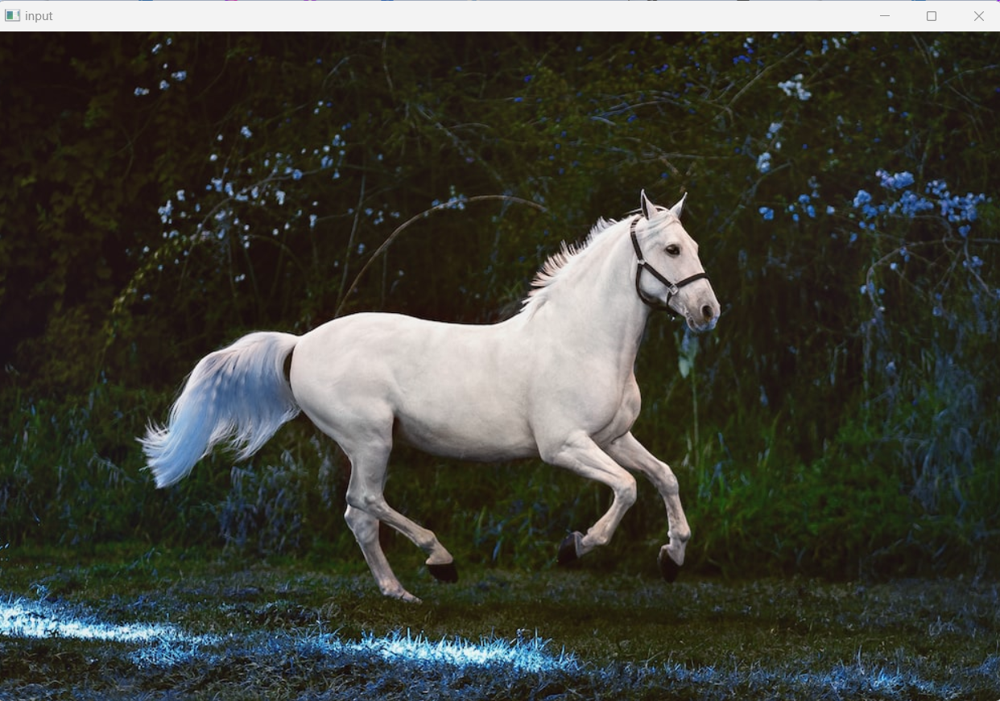
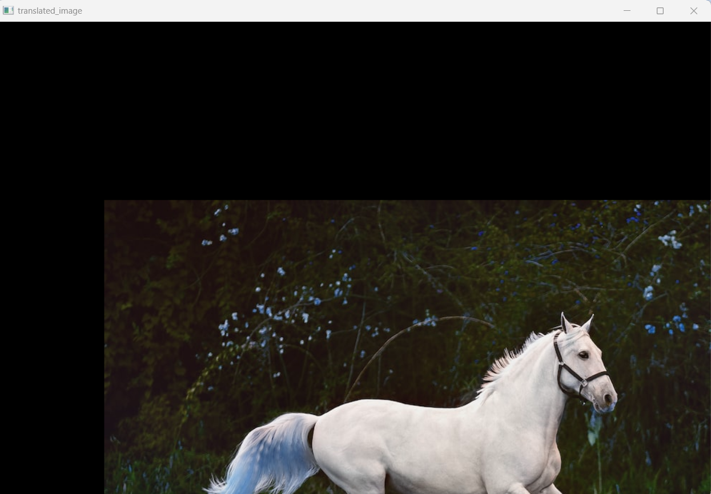
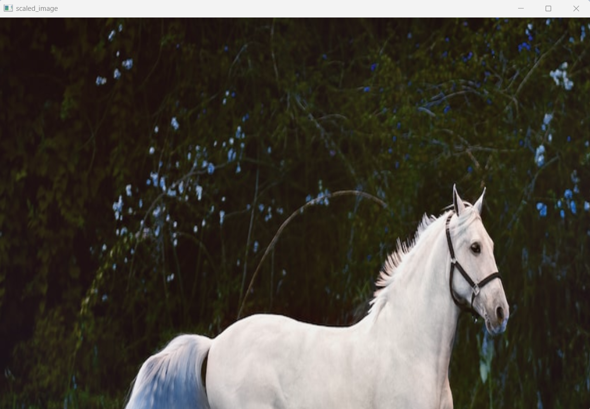
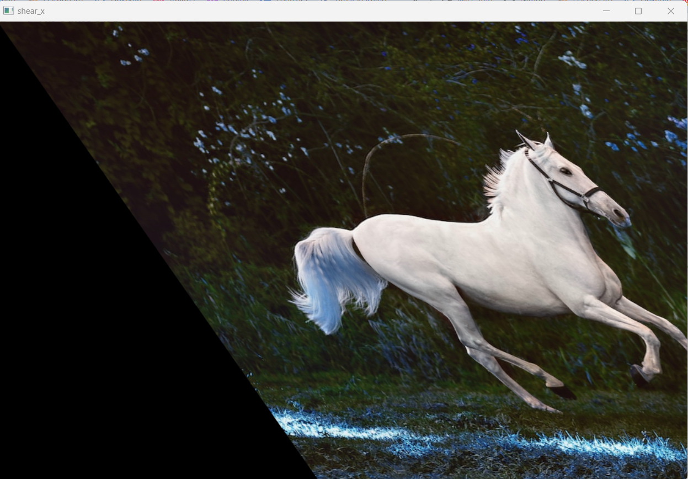
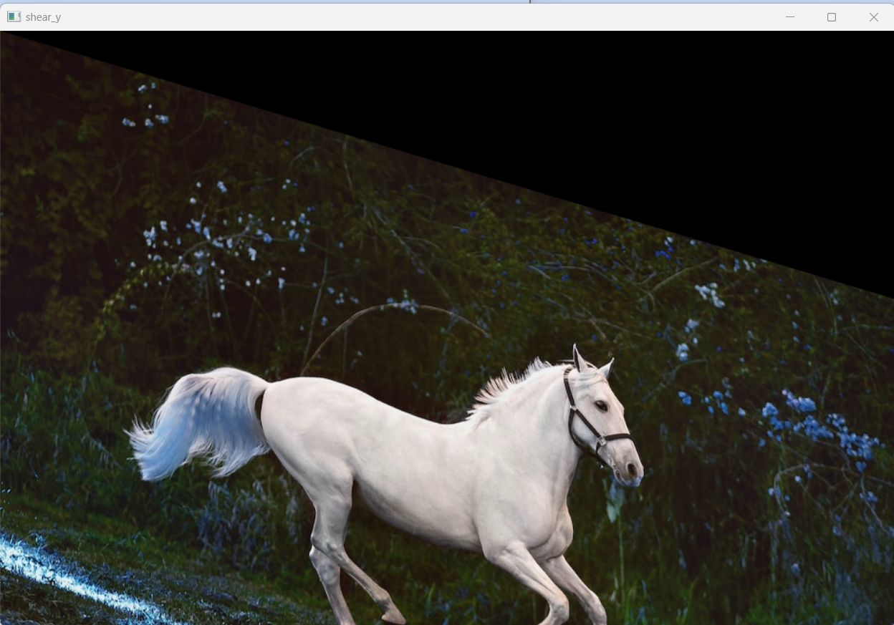
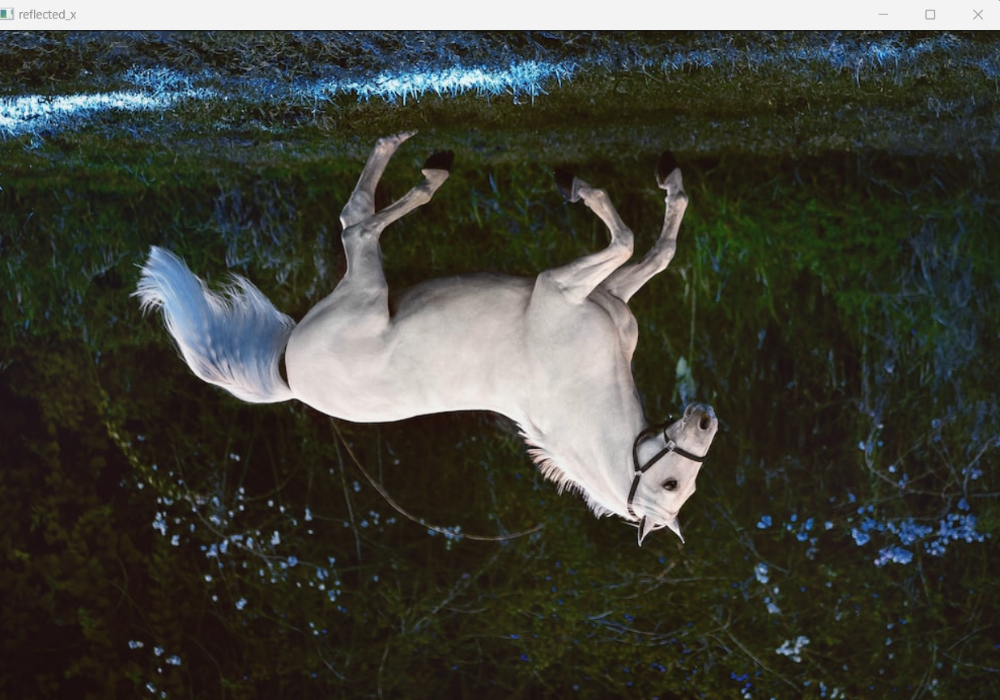
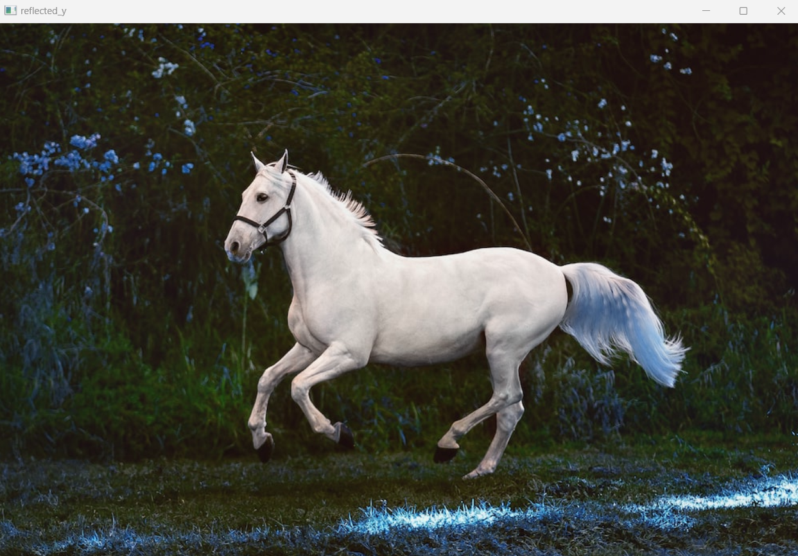
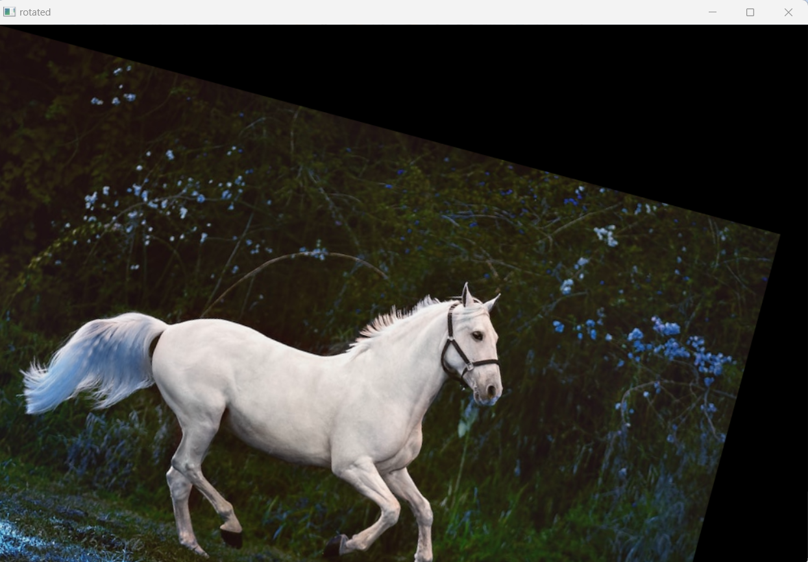
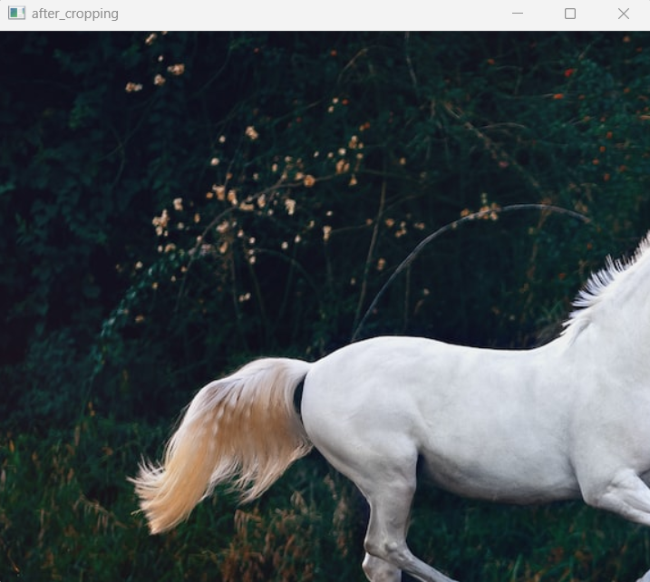

# Image-Transformation
## Aim
To perform image transformation such as Translation, Scaling, Shearing, Reflection, Rotation and Cropping using OpenCV and Python.

## Software Required:
Anaconda - Python 3.7

## Algorithm:
### Step 1:
Import the necessary libraries and read the original image and save it as a image variable.

### Step 2:
Translate the image.

### Step 3:
Scale the image.

### Step 4:
Shear the image.

### Step 5:
Reflect of image.

### Step 6:
Rotate the image.

### Step 7:
Crop the image.
### Step 8:
Display all the Transformed images.

## Program:
```python
Developed By   : M.RAJESHKANNAN
Register Number: 212221230081

# To show the original image and to find the shape of the image

import cv2
import numpy as np
img = cv2.imread('horse.jfif',-1)
original  = cv2.cvtColor(img , cv2.COLOR_BGR2RGB)
cv2.imshow('input',original)
cv2.waitKey(0)
cv2.destroyAllWindows()

original.shape
row, col, dim =original.shape

# i)Image Translation

translation = np.float32([[1,0,150],[0,1,250],[0,0,1]])
translated_image = cv2.warpPerspective(original,translation,(col,row))

cv2.imshow('translated_image',translated_image)
cv2.waitKey(0)
cv2.destroyAllWindows()

# ii) Image Scaling

scaling = np.float32([[1.2,0,0],[0,1.8,0],[0,0,1]])
scaled_image = cv2.warpPerspective(original,scaling,(col,row))

cv2.imshow('scaled_image',scaled_image)
cv2.waitKey(0)
cv2.destroyAllWindows()

# iii)Image shearing

shear_x = np.float32([[1,0.7,0],[0,1,0],[0,0,1]])
shear_y = np.float32([[1,0,0],[0.3,1,0],[0,0,1]])

sheared_x= cv2.warpPerspective(original,shear_x,(col,row))
sheared_y = cv2.warpPerspective(original,shear_y,(col,row))

cv2.imshow('shear_x',sheared_x)
cv2.waitKey(0)
cv2.destroyAllWindows()

cv2.imshow('shear_y',sheared_y)
cv2.waitKey(0)
cv2.destroyAllWindows()

# iv)Image Reflection

ref_x = np.float32([[1,0,0],[0,-1,row],[0,0,1]])
ref_y = np.float32([[-1,0,col],[0,1,0],[0,0,1]])

reflect_x= cv2.warpPerspective(original1,ref_x,(col,row))
reflect_y = cv2.warpPerspective(original1,ref_y,(col,row))

cv2.imshow('reflected_x',reflect_x)
cv2.waitKey(0)
cv2.destroyAllWindows()

cv2.imshow('reflected_y',reflect_y)
cv2.waitKey(0)
cv2.destroyAllWindows()


# v)Image Rotation

angle = np.radians(15)
mat_rotate = np.float32([[np.cos(angle),-(np.sin(angle)),0],[np.sin(angle),np.cos(angle),0],[0,0,1]])
rotate_img =cv2.warpPerspective(original,mat_rotate,(col,row))

cv2.imshow('rotated',rotate_img)
cv2.waitKey(0)
cv2.destroyAllWindows()


# vi)Image Cropping

cropped_img=img[10:500,25:600] 

cv2.imshow('after_cropping',cropped_img);
cv2.waitKey(0)
cv2.destroyAllWindows()


```
## Output:
### Original image 

### i)Image Translation




### ii) Image Scaling




### iii)Image shearing




### iv)Image Reflection





### v)Image Rotation




### vi)Image Cropping




## Result: 

Thus the different image transformations such as Translation, Scaling, Shearing, Reflection, Rotation and Cropping are done using OpenCV and python programming.
